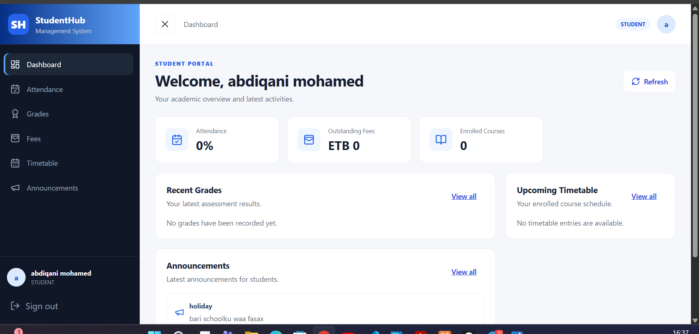
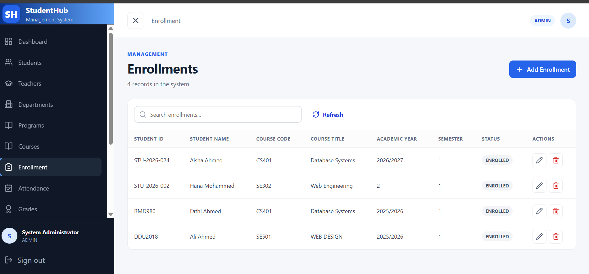
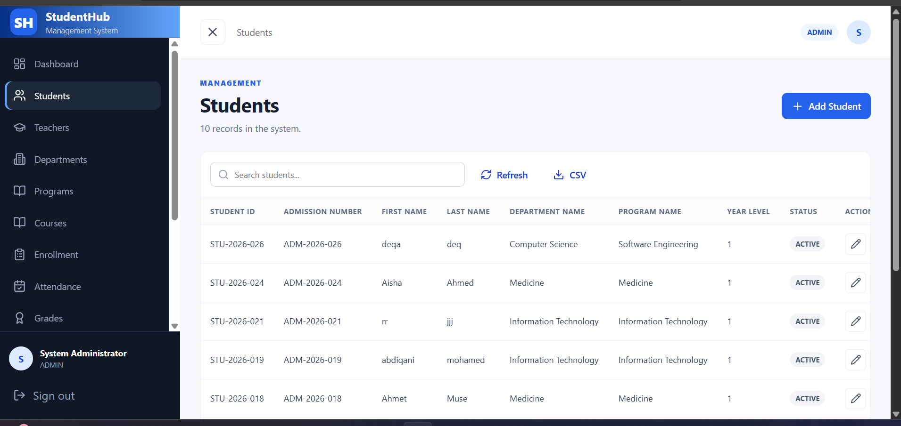

# StudentHub Management System

StudentHub is a web-based **Student Management System** designed to help educational institutions manage students, teachers, departments, programs, courses, enrollment, attendance, grades, fees, timetables, announcements, and user accounts.

> 🚧 **StudentHub is currently under active development.**
> Core management, authentication, registration, academic, and administrative features are implemented, while additional features are planned for future releases.

---

## Features

### 🔐 Authentication & User Management

- User registration
- Administrator account approval
- Registration status tracking
- Role-based authentication
- Secure password hashing with bcryptjs
- JWT-based authentication
- Account status management
- Role-based access control

### 🛠️ Administration

- Admin dashboard
- Account approvals
- Activity log
- Student management
- Teacher management
- Department management
- Program management

### 🎓 Academic Management

- Course management
- Enrollment management
- Attendance management
- Grade management
- Automatic grade-letter calculation
- Credit-weighted GPA calculation on a 4.0 scale
- Fee management
- Timetable management
- Announcements

### 👨‍🎓 Student Features

- Student dashboard
- Student enrollment information
- Academic information
- Grade information
- GPA display
- Attendance information
- Fee information
- Timetable information
- Announcements
- Account management

### 🔒 Security

- JWT authentication
- Password hashing
- Protected API routes
- Role-based authorization
- Authenticated frontend requests
- Account approval workflow
- Audit/activity logging

---

## Screenshots

### Login


### Registration


### Admin Dashboard


### Account Approvals


### Student Management



### Enrollment



### Student Dashboard



---

## Technology Stack

### Frontend

- React
- TypeScript
- React Router
- Vite
- Lucide React

### Backend

- Node.js
- Express.js
- JWT
- bcryptjs
- CORS
- MySQL2

### Database

- MySQL
- MariaDB compatible

---

## Project Structure

```text
student-management-system/
│
├── client/
│   ├── src/
│   ├── index.html
│   ├── package.json
│   └── .env.example
│
├── server/
│   ├── src/
│   ├── uploads/
│   ├── package.json
│   └── .env.example
│
├── database/
│   ├── schema.sql
│   └── seed.sql
│
├── screenshots/
│   ├── login.png
│   ├── register.png
│   ├── admin_dashboard.png
│   ├── account_approvals.png
│   ├── students.png
│   ├── enrollments.png
│   └── student_dashboard.png
│
├── .gitignore
├── package.json
└── README.md
```

---

## Installation & Setup

### Prerequisites

Before running StudentHub, make sure the following are installed:

- [Node.js](https://nodejs.org/)
- npm
- MySQL or MariaDB
- Git

Verify Node.js and npm:

```bash
node --version
npm --version
```

---

## 1. Clone the Repository

```bash
git clone https://github.com/fathiahmet/student-management-system.git

cd student-management-system
```

---

## 2. Install Dependencies

Install the root dependencies:

```bash
npm install
```

Then install the frontend and backend dependencies:

```bash
npm run install-all
```

> **Note:** If your root `package.json` does not contain an `install-all` script, install the dependencies manually by running `npm install` inside both the `client` and `server` directories.

---

## 3. Configure the Database

Create a MySQL/MariaDB database named:

```text
student_management
```

If you are using XAMPP, you can create the database through **phpMyAdmin**.

Then execute:

```text
database/schema.sql
```

If you want to populate the database with sample/demo data, also execute:

```text
database/seed.sql
```

> **Note:** Make sure your MySQL/MariaDB server is running before starting the application.

---

## 4. Configure the Backend

Inside the `server` directory, create:

```text
.env
```

Use:

```text
server/.env.example
```

as the template.

Configure the database connection, JWT secret, server port, and other required environment variables according to the `.env.example` file.

> ⚠️ **Security:** Never commit your real `.env` file or database credentials to GitHub.

---

## 5. Configure the Frontend

Inside the `client` directory, create:

```text
.env
```

Use:

```text
client/.env.example
```

as the template.

For local development, the API URL is normally:

```env
VITE_API_URL=http://localhost:5000/api
```

---

## 6. Run the Application

### Option 1 — Run Frontend and Backend Together

From the project root:

```bash
npm run dev
```

This starts both the frontend and backend using the root development script.

Frontend:

```text
http://localhost:5173
```

Backend:

```text
http://localhost:5000
```

### Option 2 — Run Frontend and Backend Separately

Start the backend:

```bash
npm run server
```

Then open another terminal and start the frontend:

```bash
npm run client
```

---

## GPA Calculation

StudentHub calculates GPA using a **credit-weighted 4.0 scale**.

The system:

1. Calculates the percentage for each assessment.
2. Calculates the overall percentage for each enrolled course.
3. Converts the course percentage to a letter grade.
4. Converts the letter grade to grade points.
5. Weights the grade points using the course credit hours.
6. Calculates the student's GPA from the total quality points and credit hours.

### Grade Scale

| Percentage | Grade | Grade Point |
| ---------: | :---: | ----------: |
|     90–100 |   A   |         4.0 |
|      80–89 |   B   |         3.0 |
|      70–79 |   C   |         2.0 |
|      60–69 |   D   |         1.0 |
|   Below 60 |   F   |         0.0 |

The GPA is displayed on the **Student Dashboard**.

---

## Future Features

The following features are planned for future releases of StudentHub.

## 🔐 Planned Authentication & User Management

- Password reset and account recovery
- Email verification
- Profile photo upload
- Change password functionality
- Improved session and token management
- Account activation, suspension, and deactivation controls

## 📝 Registration & Approval Workflow

- Administrator approval notifications
- Rejection reasons and resubmission
- Registration history
- Email notifications for approval and rejection
- Improved application review interface

## 👨‍🎓 Student Management

- Advanced student search and filtering
- Student profile enhancements
- Student document management
- Student ID generation
- Printable student ID cards
- Extended academic history
- Student transfer and withdrawal management

## 👨‍🏫 Teacher Management

- Teacher profile management
- Teacher workload management
- Teacher availability
- Teacher assignments
- Teacher performance records

## 🎓 Academic Management Enhancements

- Academic year and semester management
- Class and section management
- Advanced course prerequisite management
- Course scheduling improvements
- Academic calendar
- Curriculum management
- Semester result generation
- Student transcripts
- Printable academic reports
- Grade analytics
- Result publishing controls

## 📋 Attendance

- Attendance reports
- Attendance statistics and analytics
- Bulk attendance entry
- Attendance notifications
- Exportable attendance reports

## 💰 Finance

- Student payment management
- Fee structures
- Payment history
- Financial reports
- Printable receipts

## 📢 Communication

- In-system notifications
- Email notifications
- Announcement targeting by role, department, or program
- Student-teacher communication
- Important event reminders

## 📈 Reports & Analytics

- Student enrollment statistics
- Attendance analytics
- Academic performance analytics
- Financial reports
- Teacher workload reports
- Dashboard charts and visualizations
- PDF and Excel report exports

## ⚙️ System Administration

- Role and permission management
- System settings
- Advanced audit-log features
- Backup and restore tools
- Data import and export
- System activity monitoring

## 🎨 User Experience

- Dark mode
- Theme preferences
- Responsive mobile interface
- Improved accessibility
- Advanced dashboard customization
- Improved navigation and search
- Expanded StudentHub design system

## 🛡️ Security

- Two-factor authentication (2FA)
- Login attempt monitoring
- Account lockout protection
- Improved authorization controls
- Security audit improvements

## 🚀 Deployment

- Production deployment configuration
- Docker support
- Cloud database support
- CI/CD integration
- Production environment configuration
- Automated database backups

> **Note:** These features are planned and may be introduced incrementally in future releases.

---

## Project Status

🚧 **Active Development**

StudentHub is an educational full-stack software engineering project currently under active development.

The project already includes core functionality for:

- Authentication and authorization
- User registration and account approval
- Student and teacher management
- Department and program management
- Course management
- Enrollment management
- Attendance management
- Grade management
- Grade-letter calculation
- Credit-weighted GPA calculation
- Student dashboards
- Activity logging

Additional features, security improvements, reporting tools, and deployment functionality are planned for future releases.

---

## License

This project is currently being developed as an educational/software engineering project.

---

## Author

### Fathi Ahmed

GitHub: [@fathi-ahmet](https://github.com/fathi-ahmet)
